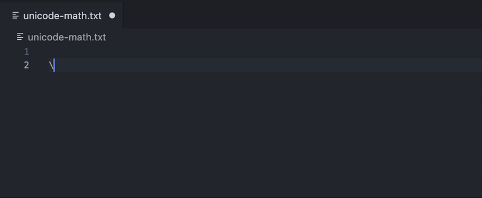

# Unicode Math Snippets

Type LaTeX-style math commands like `\alpha`, `\sum`, or `\subseteq` anywhere in VS Code and instantly insert their corresponding Unicode character.



## Features

* Supports **hundreds of common LaTeX math symbols**: Greek letters, operators, sets, arrows, logic symbols, and more
* Works in **any language or file type**
* Uses the same familiar **`\command` syntax** as LaTeX
* Lightweight — just snippets, no dependencies or runtime overhead

## Example

| Type          | Expands To | Description        |
| ------------- | ---------- | ------------------ |
| `\alpha`      | α          | Greek letter alpha |
| `\sum`        | ∑          | Summation          |
| `\subseteq`   | ⊆          | Subset or equal    |
| `\Rightarrow` | ⇒          | Implies            |
| `\mathbb{R}`  | ℝ          | Real numbers       |
| `\_1`         | ₁          | Subscript 1        |
| `\tilde`      | ˜          | Accent Tilde       |

---

## Installation

Search for **“Unicode Math Snippets”** in the VS Code Marketplace or install manually:

```bash
code --install-extension your-name.unicode-math-snippets
```

## Usage Tips

For best experience, enable snippet suggestions everywhere:

```jsonc
{
  "editor.quickSuggestions": { "other": true, "comments": true, "strings": true },
  "editor.suggest.snippetsPreventQuickSuggestions": false,
  "editor.snippetSuggestions": "top"
}
```

## Development

To run locally:

```bash
npm install -g vsce
vsce package
code --install-extension unicode-math-snippets-*.vsix
```

## License

MIT © Lucas Aschenbach
